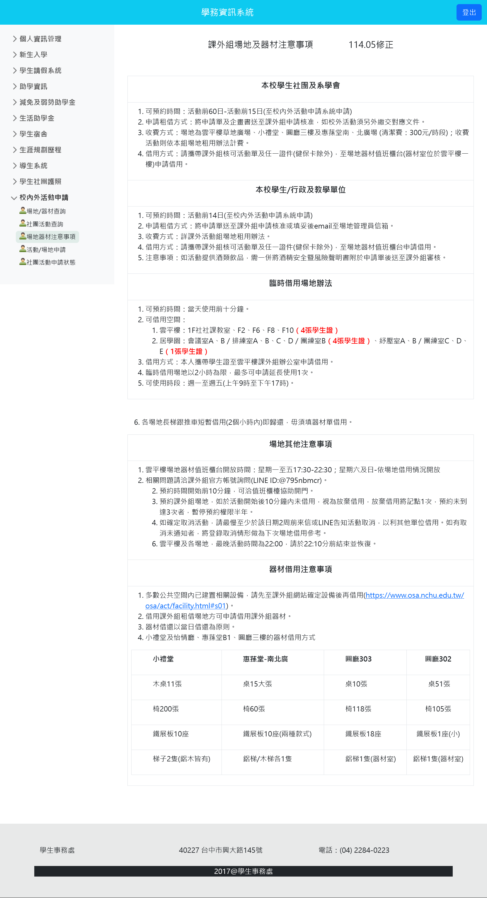
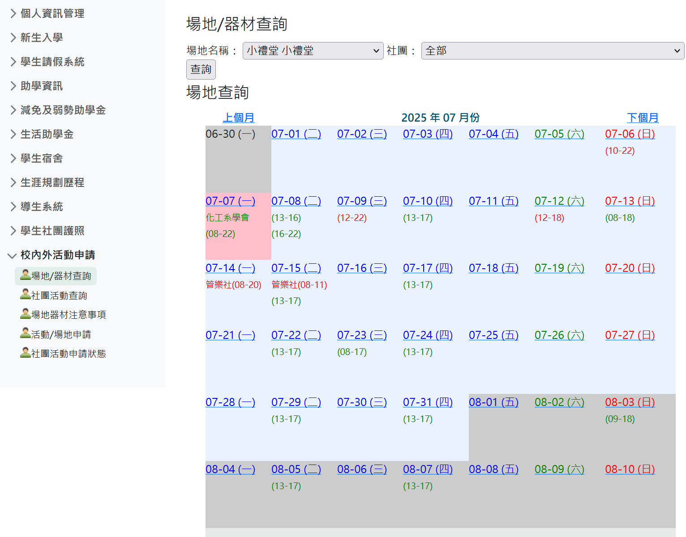

# 給之後幹部的話

最後編輯：113 屆社長王證傑 ｜ 民國 114 年 7 月 7 日

## 社團帳號資訊

請去辦一個 Bitwarden，然後叫前幹部轉交權限。帳號資訊都存裡面。

[Bitwarden](https://vault.bitwarden.com/#/organizations/76bd93b8-0551-4d3a-ad65-b30f007db720)、[Facebook](https://www.facebook.com/nchuscc) ([Meta Business Suite](https://business.facebook.com/latest/home?asset_id=405391942846178))、[Instagram](https://www.instagram.com/nchu_tutorclub)、LINE、Google、[Github](https://github.com/NCHU-TSC) 和 Cloudflare。

## 重要連結

案件／社員／案件回應／資料查詢：

入社表單：

接案／回報成功／回報失敗表單：

## 案件維護

案件過期時間：60天

1. 每天看有無新案件
   
2. 有新案件的話填入案件資訊（將之前的選起來，按著藍色圓點往下拉）
   
3. 來資訊查詢系統查詢新的案件編號，將發文工具底下的資料複製起來貼到 Meta Business 並發布
   
4. 若該案件過期或結案，記得編輯貼文加入 hashtag 「#已結案」；若家長要求撤銷則加入「已撤銷」
   

## 基本服務

### 入社流程

入社費：$200/年

1. 表單連結登入（連結可給、試算表那邊需人工審核）
2. 記得先給看規定（表單有）
3. 在社員資料那邊選確認
4. 

### 接案流程

1. 先到資料查詢系統看該案件是否結案
2. 看社員身分是否過期
3. 社員填接案申請表單

接案費：$300 社辦接案／$350 線上接案

接案失敗退費：$300

退費期限：接案後14天

## 學校方面待辦事項（僅代表 113 年、之後可能會變動）

1. 暑假中兩天一夜南投遊（社長及一名幹部，最少一人，每個社團都要，主要是社團說明會跟營火晚會）
2. 每學期前要填寫社團經費預估單，學校確認後會跟你說你這學期可用的經費
3. 上學期初社長要在學務系統登記幹部資料，其他的可視需要修改（社團基本資料、財產清點、組織章程等）
4. 每學期中、末各有一次課外活動組辦的服務性社團會議（社長及一名幹部，最少一人，主要討論預算跟活動成果，有便當）
5. 每學期中之前（期限蠻早的）記得幫大家登記功嘉獎
6. 每學期末之前（好像是學期結束後一個禮拜）記得幫大家登記社團護照
7. 下學期初記得幫社團的應屆畢業學長姐申請優秀畢業生服務獎
8. （重要！！！攸關社團生命）下學期的四月需要繳交社團評鑑，不及格會倒社
   * 資源
   * 組織
   * 活動
   * 評鑑簡報（期限較晚）：派一個人去上台跟學校報告成果
9. 社團評鑑後就可以準備幹部交接了

## 社團可辦活動

活動記得在兩個禮拜前寫企劃書、申請活動並列印活動單繳交給課外活動組，若需經費需要再填寫綜合申請表。活動結束報銷經費要收據或發票，學校統編 52024101。

1. 暑假新生訓練時的社團博覽會
2. 

## 附錄 A：學務資訊系統（學校應該會教你怎麼用）

### 有一些功能（社團資料）我不能用了，請之後的人幫忙補

### 場地器材注意事項

### 場地／器材查詢

### 社團活動查詢

### 活動／場地申請

填完列印後簽名拿去課外活動組辦公室交，課外活動記得處理學生保險。場地開門需要課外活動組簽名完的單子換鑰匙。

### 社團活動申請狀態

### 社團護照（每人應該都有）

### 社長維護社團活動

### 社長維護社團護照

辦完活動記得幫有幫忙的人登記，然後列印簽名拿給課外活動組辦公室。

